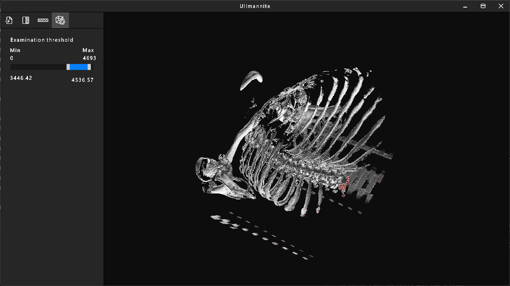
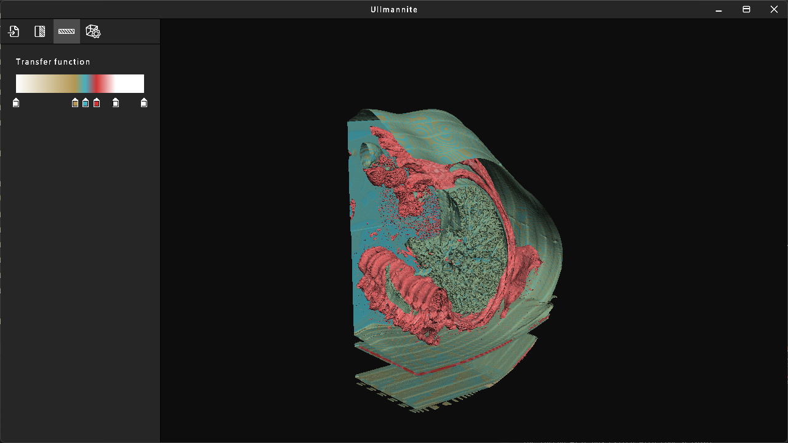

# Ullmannite


Ullmannite is a basic DICOM renderer that uses the Marching Cubes algorithm to construct a 3D mesh. This project was developed for my engineering degree. I have experimented with user interfaces, tree structures, event handlers, graphics API abstractions, Signed Distance Fields (SDF), and application architecture.

## Features

- **Cameras:** Arcball and FPS-style cameras for navigating the 3D scene.
- **Cutting:** 3-axial cutting.
- **Transfer Functions:** Color transfer functions.
- **Sampling:** Threshold sampling.

## Platforms

- **Windows:** Developed and tested on Windows 10 and Windows 11.
- **Visual Studio:** Tested and built on Visual Studio 2022 (Version 17.14.10).

## How to Build

### Windows
1. Clone the repository.
2. Initialize submodules:
   ```cmd
   git submodule init
   git submodule update
   ```
3. Run the Windows build script:
   - Navigate to the `BuildScripts` directory and run `WindowsBuild.bat`.
4. Open the solution:
   - Return to the root directory and open `Ullmannite.sln`.
5. Set `Ullmannite` as the startup project.
6. Build and run.

## Screenshots

| Bones Visualization | Lungs Visualization |
| :---: | :---: |
|  |  |